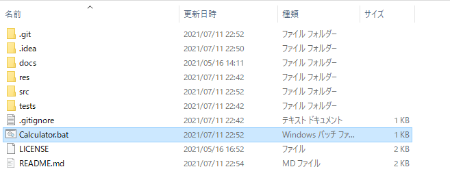

# PythonCalculator

## PythonCalculatorとは？
PythonとKivyを使用して作成したプラットフォームに依存しないグラフィカルインターフェースを備えた電卓です。
使用に必要なものはPythonとkivyのみです。

## 使い方
使い方は非常にシンプルです。

計算したい数値と演算子を入力してイコールボタンを押すだけです。


## インストール
1. Pythonのインストール\
[Pythonの公式サイト](https://www.python.org/downloads/ )に従いPythonをインストールしてください。

1. Kivyのインストール\
[Kivyの公式サイト](https://kivy.org/doc/stable/gettingstarted/installation.html )に従いKivyをインストールしてください。

1. リポジトリのクローン\
このリポジトリをクローン(コピー)してください。\
例： git bashを使用してクローン
```bash
$git clone https://github.com/RikitoNoto/PythonCalculator.git
```
 
 ## アプリケーションの実行
 リポジトリをクローンしたフォルダに移動し、Python3を使用して「CalculatorManager.py」を実行してください。
 
 例)
 ```bash
$Python3 src/CalculatorManager.py
``` 

また、以下の方法でも実行することができます。

### ・Windows
エクスプローラーからCalculator.batをダブルクリックしてください。


### ・Mac
<!---ここにMacでの実行方法を記載--->

### ・Linuxディストリビューション
<!---ここにLinuxディストリビューションでの実行方法を記載--->


## ライセンス
本ソフトウェアは、MITライセンスの元提供されています。
